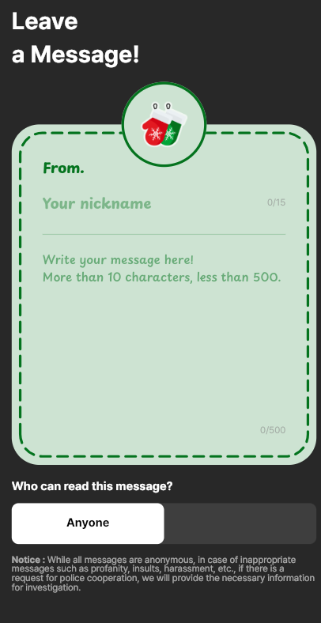
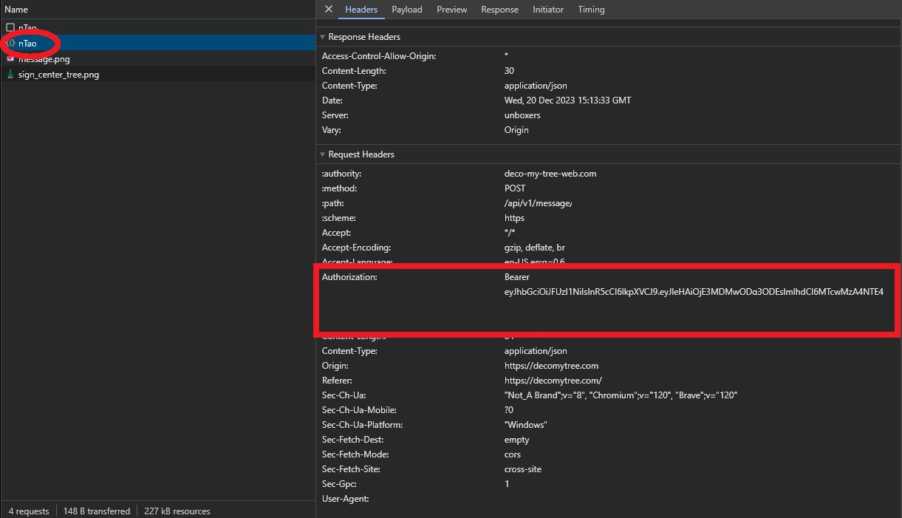

  

# decospam

A simple Python script that makes a POST request to the decomytree site.

To use this script, you need to obtain your authorization token:
1. Go to the target site and, while in the send message UI, press F12.

  

3. Navigate to the Network tab and monitor network activity.
4. Send any message, and you will see something like this.
5. 

  

6. This is how you can obtain your auth token, which you should then enter into the script.
